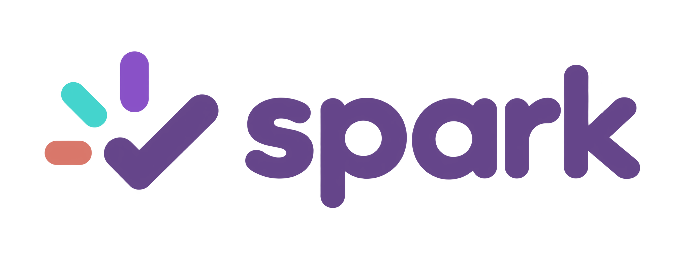

# Spark official logo

Logo chính thức của Spark là lockup ngang gồm icon check-burst tách riêng và wordmark lowercase bold `spark`.

## Màu trong logo

- Wordmark và dấu tick: Deep Purple `#65458A`.
- Tia ngang phía dưới bên trái: turquoise `#44D4CD`.
- Tia chéo phía trên bên trái: Muted Coral `#D9776A`.
- Tia dọc phía trên: violet `#8951C7`.

Navy `#111742` vẫn là màu nền/chrome chính của sản phẩm nhưng không xuất hiện trong primary logo lockup này.

## Brand palette đầy đủ

| Màu | Mã | Vai trò hiện tại |
|---|---|---|
| Navy | `#111742` | Nền/chrome chính và text đậm trong UI. |
| Turquoise | `#44D4CD` | Tương tác, completion và accent mát. |
| Violet | `#8951C7` | Accent hỗ trợ. |
| Muted Coral | `#D9776A` | Accent ấm, tiết chế. |
| Deep Purple | `#65458A` | Màu nhận diện của wordmark/tick; tối hơn violet nhưng tách biệt với navy. |

Trắng, xám và đen là neutral, không tính vào năm màu chromatic.

## Asset

- `spark-logo-primary.png`: PNG RGBA 2048×768, nền trong suốt.
- Đây là master raster chính thức hiện tại. Khi triển khai production cần dựng SVG tương ứng, tạo colorway inverse/monochrome và kiểm tra favicon/app icon ở 16, 32, 192 và 512px.
- Không thay icon check-burst thành star; ba tia luôn là ba rounded bar tách rời.

## Prompt/edit intent

Giữ nguyên bold lowercase wordmark `spark`, kerning, icon-left horizontal layout và hình học check-burst từ ảnh được chủ dự án chọn; chỉ áp palette mới, với wordmark/tick cùng Deep Purple và ba tia lần lượt turquoise–Muted Coral–violet. Không gradient, glow, shadow, mockup, 3D hoặc watermark.
