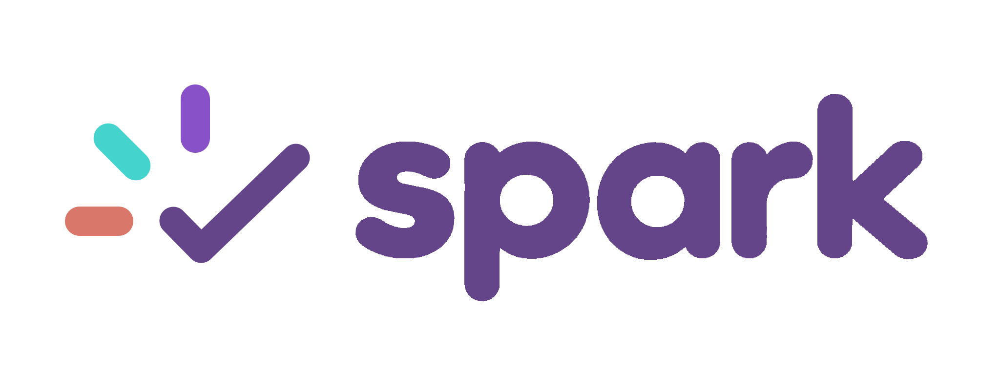

# Spark official logo

Logo chính thức của Spark là lockup ngang gồm icon check-burst tách riêng và wordmark lowercase bold `spark`.

## Màu trong logo

- Wordmark và dấu tick: Deep Purple `#65458A`.
- Tia ngang phía dưới bên trái: Muted Coral `#D9776A`.
- Tia chéo phía trên bên trái: turquoise `#44D4CD`.
- Tia dọc phía trên: violet `#8951C7`.

Navy `#111742` vẫn là màu nền/chrome chính của sản phẩm nhưng không xuất hiện trong primary logo lockup này.

## Brand palette đầy đủ

| Màu | Mã | Vai trò hiện tại |
|---|---|---|
| Navy | `#111742` | Nền/chrome chính và text đậm trong UI. |
| Turquoise | `#44D4CD` | Tương tác, completion và accent mát. |
| Violet | `#8951C7` | Accent hỗ trợ. |
| Muted Coral | `#D9776A` | Accent ấm, tiết chế. |
| Deep Purple | `#65458A` | Màu nhận diện của wordmark/tick; tối hơn violet nhưng tách biệt với navy. |

Trắng, xám và đen là neutral, không tính vào năm màu chromatic.

## Asset

- `spark-logo-primary.png`: PNG RGBA 2048×768, nền trong suốt.
- `spark-logo-primary.svg`: SVG path 2048×768, nền trong suốt; không nhúng bitmap.
- `spark-logo-negative.png`: PNG RGBA 2048×768, toàn bộ logo trắng trên nền trong suốt.
- `spark-logo-negative.svg`: SVG colorway trắng cho background tối.
- App icon production hiện theo D-133: SVG do chủ dự án cung cấp, tick/vòng tròn/vạch trắng trên gradient xanh–Navy. Quy tắc check-burst dưới đây áp dụng cho logo/mark sidebar, không thay source icon v2.
- Không thay icon check-burst thành star; ba tia luôn là ba rounded bar tách rời.
- Tick dùng stroke 57 đơn vị trong viewBox 2048×768, tương đương khoảng 68% độ dày của bản logo ban đầu.
- Ba tia là ba capsule cùng kích thước 140×60 đơn vị, mỏng khoảng 82.5% so với tia ngang ban đầu; chỉ khác hướng xoay và màu.

## Web app assets

- `public/brand/spark-logo.svg` và `.png`: bản logo primary được phục vụ trực tiếp trong web app.
- `public/brand/spark-logo-negative.svg` và `.png`: bản negative dùng trên sidebar/background tối.
- `public/spark-mark.svg` và `public/spark-mark-maskable.svg`: source tham chiếu cho app mark primary nhiều màu trước đây.
- `public/spark-mark-negative.svg`: app mark trắng nền trong suốt cho compact rail.
- `public/spark-favicon.svg`: favicon negative trên rounded-square Navy.
- `public/spark-app-icon-negative.svg`: source negative Navy full-bleed cho Apple/maskable.
- `public/icons/spark-favicon-negative-32.png`: favicon raster fallback.
- `public/icons/spark-pwa-negative-192.png`, `spark-pwa-negative-512.png`: Chrome/PWA standard icon.
- `public/icons/spark-apple-negative-180.png`: Apple Touch Icon Navy full-bleed.
- `public/icons/spark-maskable-negative-512.png`: PWA maskable icon Navy full-bleed.

## Prompt/edit intent

Giữ nguyên bold lowercase wordmark `spark`, kerning và icon-left horizontal layout từ ảnh được chủ dự án chọn. Dùng check-burst đã tinh chỉnh với tick thanh và ba tia đồng kích thước; wordmark/tick cùng Deep Purple, tia ngang dùng Muted Coral, tia chéo dùng turquoise và tia dọc dùng violet. Không gradient, glow, shadow, mockup, 3D hoặc watermark.

## App icon v2 — 2026-10-05

`spark-app-icon-v2.svg` là bản gốc nguyên byte của file `spark-app-icon-editable 2.svg` do chủ dự án gửi. `spark-app-icon-editable.svg` là bản xuất cũ để tham chiếu. Chạy `npm run icons:generate` để tạo SVG/PNG/ICO v2 rồi `npm run icons:verify` để kiểm tra kích thước, nền/alpha, artwork và safe zone maskable.

- Apple: `public/icons/spark-apple-v2-180.png`, vuông full-bleed.
- Chrome/PWA any: `public/icons/spark-pwa-v2-192.png`, `spark-pwa-v2-512.png`, góc bo.
- Maskable: `public/icons/spark-maskable-v2-512.png`, artwork 90%, nền full-bleed.
- Favicon: `public/spark-favicon-v2.svg`, `.ico`, PNG 16/32/48 trong `public/icons/`.

Danh sách icon không có `v2` ở phần trên là source/asset lịch sử, không còn được metadata/manifest/SW dùng cho icon app. Logo primary/negative/compact rail giữ nguyên.
