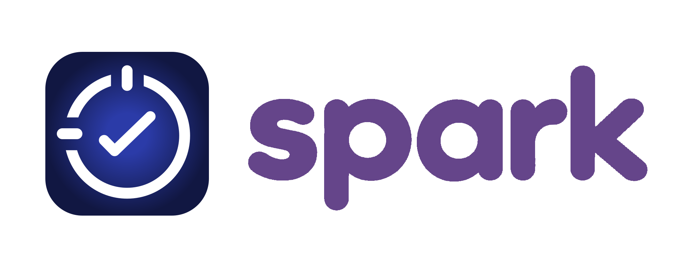

# Spark — logo và icon hiện hành

Cập nhật 05/10/2026, D-133/D-134. Biểu tượng chính thức là tick/vòng tròn/vạch trắng trên badge gradient xanh–Navy do chủ dự án gửi. Logo chính ghép biểu tượng này với wordmark `spark` đã duyệt; giữ nguyên outlines/kerning, không thay bằng font hệ thống.



## Source và bản logo

- `spark-app-icon-v2.svg`: source nguyên byte của `spark-app-icon-editable 2.svg` người dùng gửi, 512×512.
- `spark-wordmark.svg`: vector chữ đã duyệt, tách khỏi mark check-burst cũ, không gồm biểu tượng.
- `spark-logo-primary-v2.svg` / `.png`: badge mới + wordmark Deep Purple #65458A, 2048×768.
- `spark-logo-negative-v2.svg` / `.png`: cùng badge + wordmark trắng, dành cho nền tối/sidebar.
- File `spark-logo-primary.svg/.png` và `spark-logo-negative.svg/.png` là alias nội dung hiện hành.
- `spark-app-icon-editable.svg` là bản check-burst cũ đã xuất trước khi nhận thiết kế mới, chỉ giữ làm tham chiếu. Concept/variation ở thư mục lân cận cũng là lịch sử.

## Vị trí sử dụng trong app

| Vị trí | Asset runtime |
|---|---|
| Sidebar desktop mở rộng và menu mobile | `/brand/spark-logo-negative-v2.svg` |
| Sidebar desktop thu gọn | `/spark-mark-v2.svg` |
| Logo chính trên nền sáng / bộ asset dùng chung | `/brand/spark-logo-v2.svg` và `.png` |
| Favicon | `/spark-favicon-v2.svg`, `.ico`; PNG 16/32/48px trong `/icons/` |
| iPhone/Home Screen | `/icons/spark-apple-v2-180.png`, vuông full-bleed |
| Chrome/PWA thông thường | `/icons/spark-pwa-v2-192.png`, `spark-pwa-v2-512.png`, góc bo |
| PWA maskable | `/icons/spark-maskable-v2-512.png`, nền full-bleed, artwork 90% |

Toàn bộ URL logo/mark/icon cũ trong `public/` cũng trả artwork mới để tương thích. App/SW dùng URL v2 để đổi cache. Logo primary/negative đều có nền ngoài artwork trong suốt; riêng badge giữ gradient như bản người dùng gửi. Palette app và nền canvas không đổi.

## Sinh và kiểm tra

```bash
npm run icons:generate
npm run icons:verify
```

Generator app icon tạo SVG/PNG/ICO và alias cũ; generator brand ghép badge với outlines wordmark, xuất logo SVG/PNG và mark compact. Verifier kiểm tra kích thước, alpha, gradient/artwork, maskable safe zone, ICO và các alias logo. Regression browser kiểm tra metadata, offline cache, sidebar mở/thu gọn và drawer mobile 390px.

Không thêm tia, đổi hình học, vẽ lại wordmark hoặc dùng CSS filter. Không lấy lại check-burst từ concept/variation làm logo production.
